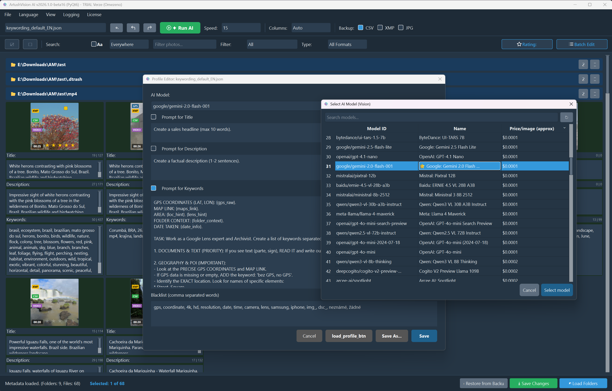
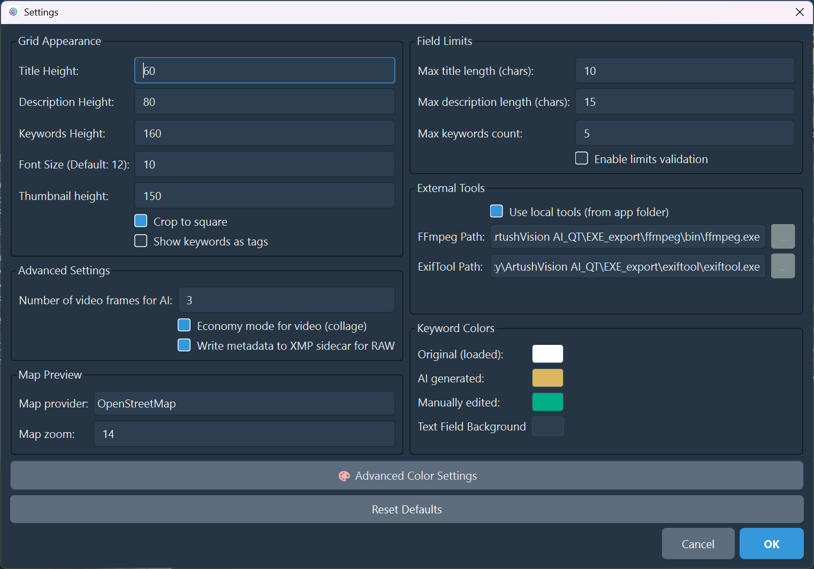
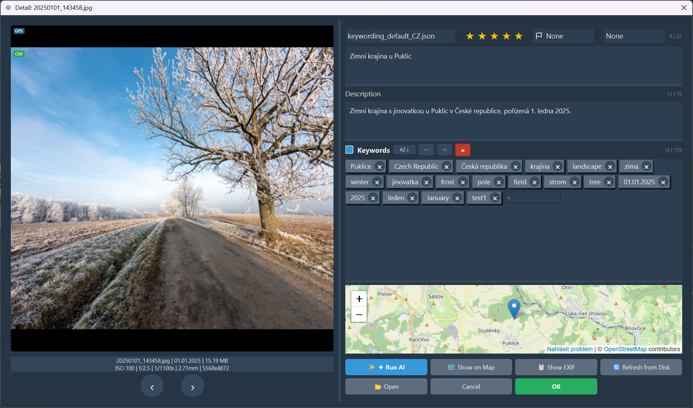
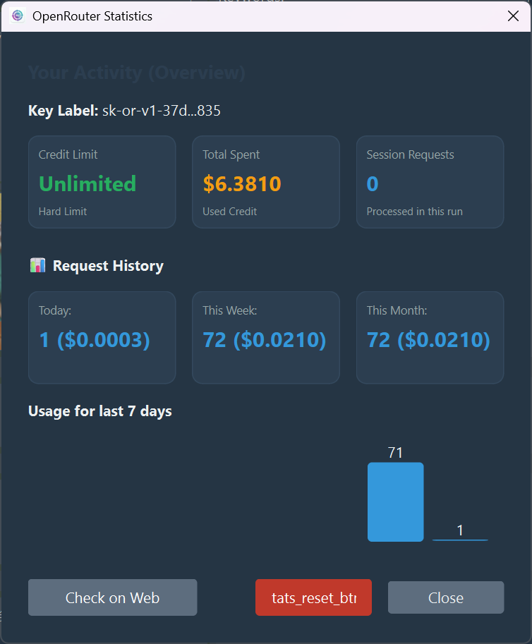

# ArtushVision AI

**The Ultimate AI-Powered Metadata & Keywording Tool for Photographers and Videographers**

*Automate your stock photography workflow with state-of-the-art Vision AI.*

---

## About The Project

**ArtushVision AI** is a sophisticated desktop application designed to revolutionize the workflow of  photographers, archivists, and digital asset managers. Built with **Python** and **PyQt6**, it leverages state-of-the-art Large Language Models (LLMs) via OpenRouter to analyze images and videos, automatically generating accurate titles, descriptions, and keywords.

"Custom AI prompts supported for specialized workflows, unlocking **unlimited possibilities for cataloging photos and videos** ."****"Custom AI prompts supported for specialized workflows."***

It bridges the gap between raw media files and ready-to-sell stock assets by combining visual analysis with "hard facts" like GPS data, dates, and folder context.

Key Use Cases

* **Stock Photography/Videography:** Automates the tedious process of tagging content for agencies (Shutterstock, Adobe Stock, Getty) while adhering to strict metadata limits.
* **Digital Archiving:** Rapidly organizes large collections by identifying content, OCR text, and specific locations.
* **Location-Aware Tagging:** Uses GPS coordinates to accurately identify landmarks, cities, and countries instead of generic guesses.

# Main Features

### Advanced AI Analysis

* **Multi-Model Support:** Switch between top-tier Vision models (Google Gemini 2.0, Claude 3.5, GPT-4o) via OpenRouter.
* **Context-Aware Prompting:** The AI analyzes not just the image, but also GPS coordinates, Google Maps links, folder names, dates, and lens information.
* **Video Intelligence:** Extracts and analyzes video frames to generate metadata for video files, supporting technical data analysis (duration, fps).
* **Bilingual Output:** Generates keywords in English and a local language (e.g., Czech) simultaneously.

### Modern & Efficient GUI

* **Responsive Grid:** High-performance thumbnail grid capable of handling thousands of files.
* **Visual Status System:** Color-coded cells indicate file status (Unedited, Modified, Saved, Validation Error).
* **Interactive Badges:** Quick indicators for GPS, RAW, Video, or XMP sidecar presence.
* **Tag Bubbles:** Drag-and-drop interface for managing keywords individually.

### Workflow & Batch Operations

* **Bulk Editing:** Add, remove, or replace metadata across hundreds of files instantly.
* **Smart Filtering:** Filter by file type (RAW/JPG/Video), Rating, Flags, or Color Labels.
* **Undo/Redo:** Full history support to safely revert changes.
* **Cost Tracking:** Monitors API usage and calculates costs per session.

## Major Advantages

1. **Reduced Hallucinations:** By feeding the AI specific data (GPS, Date, Folder Name), the output is factually accurate.
2. **Speed:** Multi-threaded processing allows for analyzing hundreds of images in minutes.
3. **Compliance:** Built-in validators ensure titles and keywords meet stock agency requirements.
4. **Safety:** Uses **ExifTool** for industry-standard metadata writing and creates XMP

**"Full control over your budget."**

