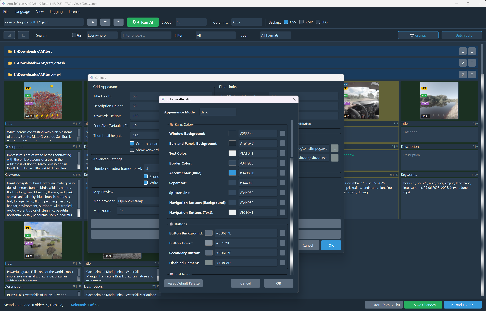

  <h1>ArtushVision AI</h1>
  

    <strong>The Ultimate AI-Powered Metadata & Keywording Tool for Photographers and Videographers</strong>
  

    
    
  

    <em>Automate your stock photography workflow with state-of-the-art Vision AI.</em>
  

## 📖 About The Project

**ArtushVision AI** is a sophisticated desktop application designed to revolutionize the workflow of travel/stock photographers, archivists, and digital asset managers. Built with **Python** and **PyQt6**, it leverages state-of-the-art Large Language Models (LLMs) via OpenRouter to analyze images and videos, automatically generating accurate titles, descriptions, and keywords.

It bridges the gap between raw media files and ready-to-sell stock assets by combining visual analysis with "hard facts" like GPS data, dates, and folder context to prevent AI hallucinations.

> **"Custom AI prompts supported for specialized workflows, unlocking unlimited possibilities for cataloging photos and videos."**

  

---

## 🎯 Key Use Cases

* **Stock Photography/Videography:** Automates the tedious process of tagging content for agencies (Shutterstock, Adobe Stock, Getty) while adhering to strict metadata limits.
* **Digital Archiving:** Rapidly organizes large collections by identifying content, OCR text, and specific locations.
* **Location-Aware Tagging:** Uses GPS coordinates to accurately identify landmarks, cities, and countries instead of generic guesses.

---

## 🚀 Main Features

### 🧠 Advanced AI Analysis

* **Multi-Model Support:** Switch between top-tier Vision models (Google Gemini 2.0, Claude 3.5, GPT-4o) via OpenRouter to balance cost and performance.
* **Context-Aware Prompting:** The AI doesn't just "see" the image; it is fed GPS coordinates, Google Maps links, folder names, dates, and lens information to provide contextually accurate results.
* **Video Intelligence:** Automatically extracts 3-20 representative frames (start, middle, end) to analyze video content as a sequence. It also reads technical data like duration and FPS.
* **Bilingual Output:** Capable of generating keywords in English and a local language (e.g., Czech) simultaneously.

  
  
  
<em>Fully customizable workflow to fit your unique needs.</em>

### 🖥️ Modern & Efficient GUI

* **Responsive Grid:** High-performance thumbnail grid capable of handling thousands of files using virtualization.
* **Visual Status System:** Color-coded cells indicate file status:
  * ⚪ **White:** Unedited.
  * 🟢 **Green:** Saved.
  * 🟡 **Yellow:** Modified/Unsaved.
  * 🔴 **Red Border:** Validation Error (e.g., Title too short).
* **Interactive Badges:** Quick indicators for `GPS`, `RAW`, `VIDEO`, or `XMP` sidecar presence.
* **Tag Bubbles:** Drag-and-drop interface for managing keywords individually.

  

### ⚡ Workflow & Batch Operations

* **Bulk Editing:** Add, remove, or replace metadata across hundreds of files instantly using the Batch Bar.
* **Smart Filtering:** Filter by file type (RAW/JPG/Video), Rating (Stars), Flags (Pick/Reject), or Color Labels.
* **Undo/Redo:** Full history support to safely revert accidental changes.
* **Cost Tracking:** Monitors API usage and calculates costs per session to help you manage your budget.

  
  
<em>Fast keywords filtering.</em>

  
  
<em>Full control over your budget.</em>

---

## 🌟 Major Advantages

1. **Reduced Hallucinations:** By feeding the AI specific data (GPS, Date, Folder Name), the output is factually accurate and specific (e.g., identifying "Charles Bridge" instead of just "bridge").
2. **Speed:** Multi-threaded processing allows for analyzing hundreds of images in minutes.
3. **Compliance:** Built-in validators ensure titles and keywords meet stock agency character limits and counts.
4. **Safety:** Uses **ExifTool** for industry-standard metadata writing. For RAW files, it writes to **XMP sidecars** to avoid corrupting original files, and creates automatic backups.

---

## 🛠️ System Requirements

* **OS:** Windows 10/11
* **API Key:** An active [OpenRouter](https://openrouter.ai/) API key.
* **Dependencies:**
  * [ExifTool](https://exiftool.org/) (usually bundled or auto-detected).
  * [FFmpeg](https://ffmpeg.org/) (required for video processing).

---

  <em>Developed by ArtushFoto.eu</em>

