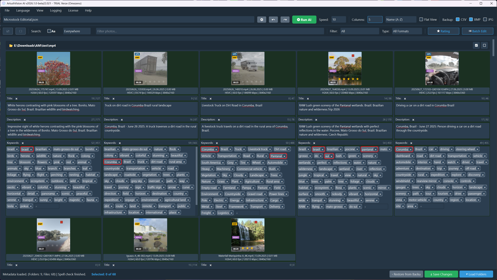
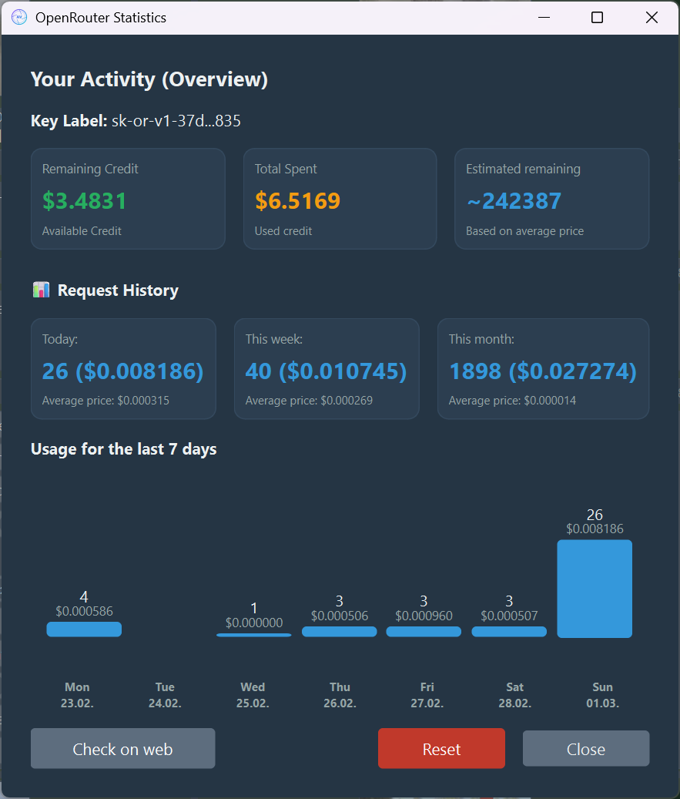
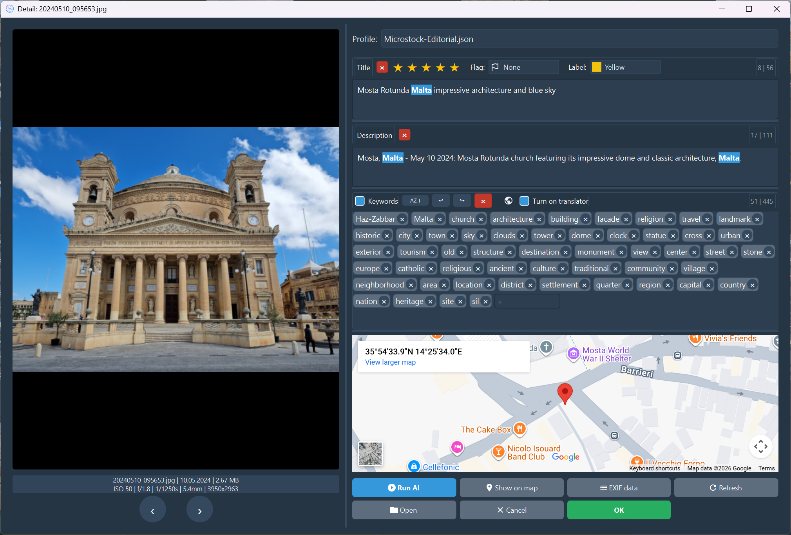
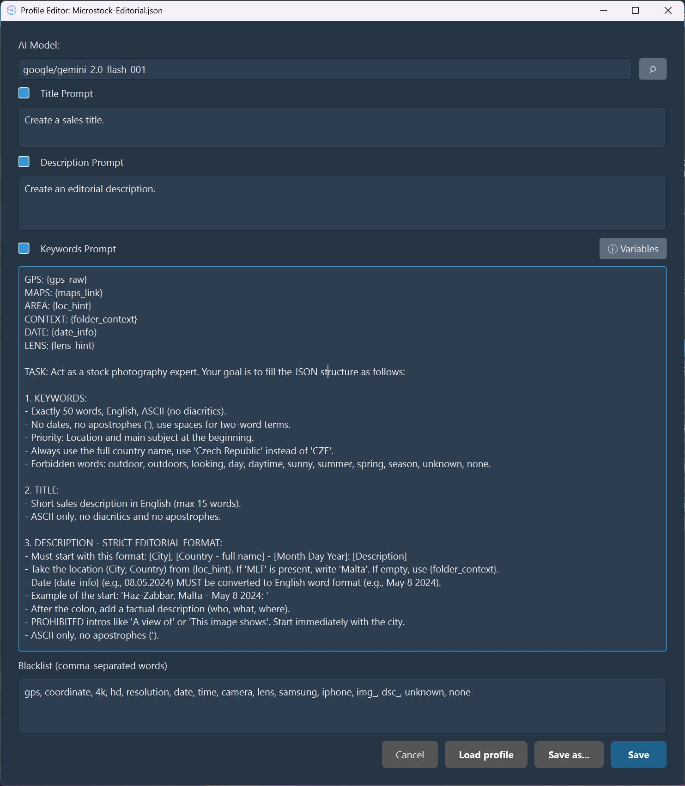
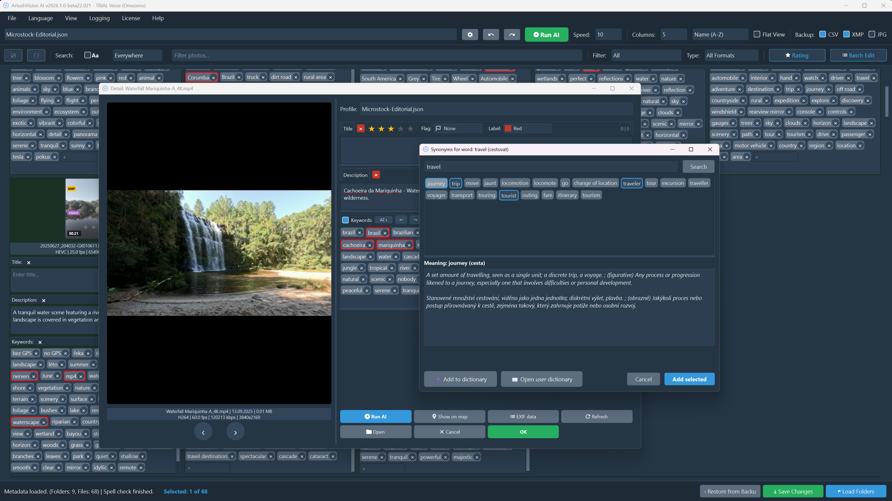
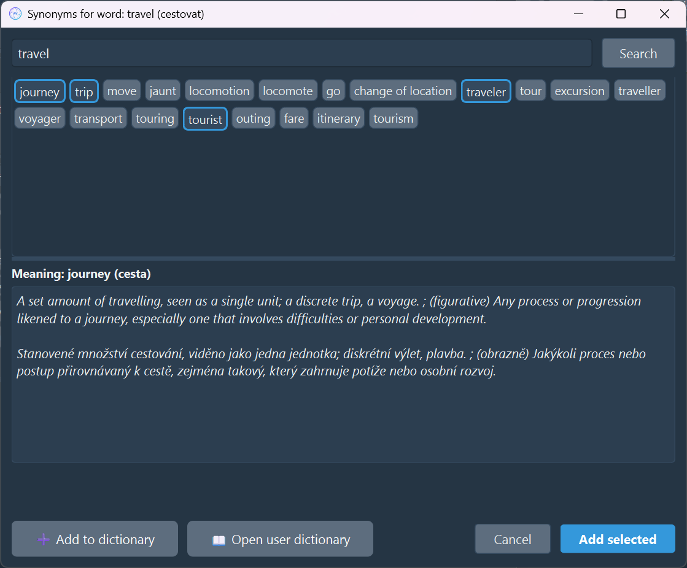
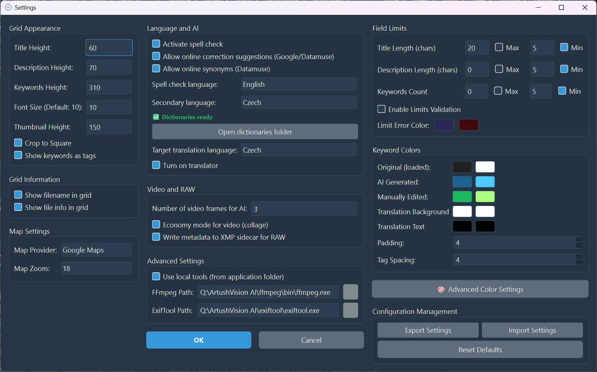
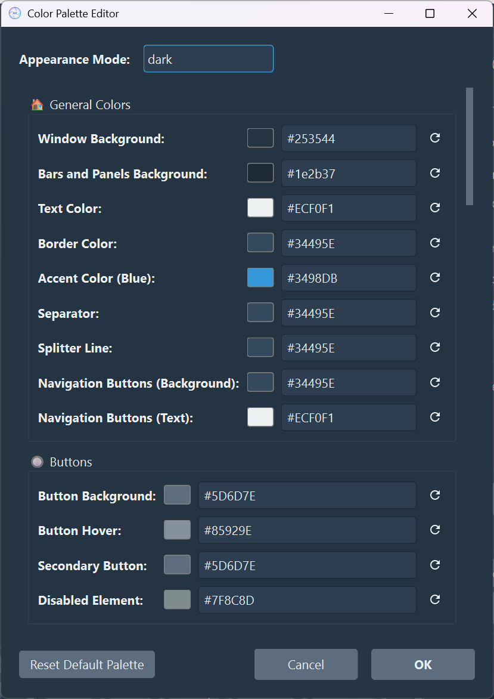

# ArtushVision AI

**ArtushVision AI** is a professional desktop application designed to streamline the workflow of photographers, videographers, and archivists. It leverages state-of-the-art Computer Vision AI (via OpenRouter) to automatically generate keywords, titles, and descriptions for your media assets **JPG, RAW and video**, while providing robust tools for manual metadata management.

---

## 📋 Table of Contents

- [ArtushVision AI - Comprehensive User Manual](#artushvision-ai---comprehensive-user-manual)
  - [📋 Table of Contents](#-table-of-contents)
  - [1. Installation \& Setup](#1-installation--setup)
    - [System Requirements](#system-requirements)
    - [First Launch](#first-launch)
  - [2. Interface Overview](#2-interface-overview)
    - [Top Toolbar](#top-toolbar)
    - [Filter Bar](#filter-bar)
    - [The Image Grid](#the-image-grid)
  - [3. AI Analysis Workflow](#3-ai-analysis-workflow)
  - [4. Manual Editing \& Detail View](#4-manual-editing--detail-view)
    - [The Editor](#the-editor)
    - [Saving](#saving)
  - [5. Batch Operations](#5-batch-operations)
  - [6. Advanced Features](#6-advanced-features)
    - [🧠 Custom AI Profiles](#-custom-ai-profiles)
    - [📝 Synonyms \& Translation](#-synonyms--translation)
    - [🌍 Geolocation](#-geolocation)
  - [7. Settings \& Configuration](#7-settings--configuration)
  - [8. Keyboard Shortcuts](#8-keyboard-shortcuts)

---

## 1. Installation & Setup

### System Requirements

* **OS**: Windows 10/11 (64-bit).
* **Internet**: Required for AI analysis, maps, and online spell checking.
* **Dependencies**: The application requires **ExifTool** and **FFmpeg** to function correctly. These are bundled with the application in the `exiftool/` and `ffmpeg/` folders.

### First Launch

1. Run `ArtushVisionAI.exe`.
2. **License**: If you have a license key, enter it when prompted. You can also use the Trial version with limited features (limit on daily saves/AI calls).
3. **API Key**:
   * Navigate to **File** > **API Key**.
   * Enter your **OpenRouter API Key**. You can obtain one at openrouter.ai.
   * This key is stored securely locally.

---

## 2. Interface Overview

The application is designed around a central grid view with collapsible panels.

### Top Toolbar

* **Profile**: Select the AI system prompt (e.g., "Stock Photography", "Social Media"). Click the **Gear icon** to edit profiles.
* **Run AI**: The green play button starts the analysis for selected images.
* **Speed**: Controls the number of parallel threads (1-20). Higher is faster but uses more CPU/Bandwidth.
* **Columns**: Adjust the number of columns in the grid or set to "Auto".
* **Sorting**: Sort by Name or Date (Ascending/Descending).
* **Flat View**: Toggle to see all files from subfolders in a single flat list.
* **Backup**: Checkboxes to enable/disable backups for CSV, XMP, and Original files.

### Filter Bar

Located below the toolbar, this bar helps you organize your workspace.

* **Select**: Buttons to Select All / Select None.
* **Search**: Filter images by text (Title, Description, Keywords, or Filename).
  * **Aa**: Toggle case sensitivity.
  * **Target**: Choose which field to search in.
* **Status Filter**: Filter by state (Selected, Modified, Done, Error, etc.).
* **Type Filter**: Show only RAW, JPG, or Video files.
* **Toggle Panels**: Buttons to show/hide the **Rating Bar** and **Batch Edit Bar**.

### The Image Grid

Each cell represents a media file.

* **Visual States**:
  * **Gray/White**: Unchanged / Default.
  * **Yellow**: Modified (unsaved changes).
  * **Green**: Saved / Metadata loaded.
  * **Red**: Validation error (e.g., title too long).
* **Badges**: Small icons on thumbnails provide quick info:
  * 📍 **GPS**: File has geolocation data.
  * **XMP**: An XMP sidecar file exists.
  * **ORIG**: An original backup exists.
  * **RAW**: Indicates a RAW file.
  * **VIDEO**: Indicates a video file.
  * ⚠️: Indicates a corrupted file or load error.

---

## 3. AI Analysis Workflow

1. **Load Files**: Click **Load Folders** (bottom right) and select your directory.
2. **Select Files**: Click to select images. Use `Shift+Click` for range or `Ctrl+Click` for individual selection.
3. **Choose Profile**: Select a profile that matches your content type.
4. **Run**: Click **Run AI**.
   * A progress dialog will appear.
   * You can stop the process at any time.
   * **Cost**: The estimated cost (based on input tokens) is displayed after analysis.

**Note**: For videos, the AI analyzes multiple frames (configurable in Settings) to understand the context of the clip.

---

## 4. Manual Editing & Detail View

Double-click any image to enter the **Detail View**. This is a powerful editor for individual files.

### The Editor

**Text Fields**: Edit Title, Description, and Keywords.

* **Counters**: Real-time word and character counts (e.g., `5 | 45`).
* **Spell Check**: Misspelled words are underlined in red. Right-click for suggestions.

**Keywords (Bubbles)**:

* **Add**: Type in the input box or use the `+` button.
* **Remove**: Click the `×` on the bubble.
* **Reorder**: Drag and drop bubbles to change priority.
* **Color Coding**:
  * **Blue**: Generated by AI.
  * **Green**: Manually added.
  * **Black/White**: Original keywords from the file.

**Map**: An interactive map shows the GPS location. You can zoom in/out.

**Navigation**: Use the arrow buttons or keys to move to the next/previous image without closing the window.

### Saving

* **Save Changes**: Click **Save Changes** in the bottom right of the main window.
* **Backups**:
  * **CSV**: Creates a spreadsheet with all metadata.
  * **XMP**: Writes metadata to a sidecar file (safer for RAW/Video).
  * **Original**: Preserves the original file with a `.original` extension (for JPG).

---

## 5. Batch Operations

Toggle the **Batch Edit** panel using the list icon in the filter bar. This allows you to modify hundreds of files at once.

1. **Select Target**: Choose where to apply changes (Title, Description, Keywords, or Everywhere).
2. **Input Text**: Type the text you want to add, remove, or find.
3. **Actions**:
   * **Add**: Appends text. For keywords, it adds a new tag. For text, it appends with a space.
   * **Remove**: Removes the specified word or tag.
   * **Replace**: Replaces "Text A" with "Text B". Use the format `Old->New` or open the dedicated Replace Dialog (`Ctrl+H`).
   * **Delete Field**: Clears the entire content of the selected field.
   * **Clear All**: Removes ALL metadata from selected files.

---

## 6. Advanced Features

### 🧠 Custom AI Profiles

Create custom instructions for the AI.

1. Click the **Gear Icon** next to the profile selector.
2. **Model**: Choose a vision model (e.g., `google/gemini-2.0-flash-001`, `gpt-4o`).
3. **Prompts**: Define specific rules.
   * **Variables**: Use dynamic placeholders like `{gps_raw}` (coordinates), `{date_info}` (date), `{folder_context}` (folder name).
   * *Example*: "Describe this image taken in {loc_hint} on {date_info}."
4. **Blacklist**: Words entered here will be automatically removed from AI output.

### 📝 Synonyms & Translation

* **Synonyms**: Right-click a keyword to open the Synonym Dialog. It fetches related words from online databases (Datamuse).
* **Translation**: If enabled in Settings, the app can show tooltips with translations of keywords into your native language.

### 🌍 Geolocation

* The app reads GPS data from EXIF.
* AI uses this data to identify landmarks (e.g., knowing coordinates point to "Eiffel Tower").
* **Map Provider**: Switch between Google Maps and OpenStreetMap in Settings.

---

## 7. Settings & Configuration

Go to **File** > **Grid Settings**.

* **Appearance**:
  * **Thumbnail Height**: Adjust the size of grid images.
  * **Field Heights**: Customize how much space Title/Description/Keywords take up.
  * **Font Size**: Scale text for better readability.
* **Language & AI**:
  * **Spellcheck**: Enable/Disable and select primary/secondary languages.
  * **Translation**: Set target language for tooltips.
* **Limits**:
  * Set min/max character counts for Title and Description.
  * Set min/max keyword counts.
  * Useful for meeting stock agency requirements (e.g., Shutterstock, Adobe Stock).
* **Video & RAW**:
  * **AI Frames**: How many frames to analyze per video (default 3).
  * **Write RAW to XMP**: Recommended to keep RAW files untouched.
* **Advanced**:
  * **External Tools**: Paths to `exiftool.exe` and `ffmpeg.exe`.

---

## 8. Keyboard Shortcuts

| Key              | Action           | Context     |
| :----------------- | :----------------- | :------------ |
| `Ctrl + A`       | Select All       | Grid        |
| `Ctrl + D`       | Deselect All     | Grid        |
| `Ctrl + S`       | Save Changes     | Global      |
| `Ctrl + Z`       | Undo             | Global      |
| `Ctrl + Y`       | Redo             | Global      |
| `Ctrl + H`       | Batch Replace    | Grid        |
| `P`              | Flag as Picked   | Grid        |
| `X`              | Flag as Rejected | Grid        |
| `U`              | Unflag           | Grid        |
| `1` - `5`        | Set Star Rating  | Grid        |
| `0`              | Clear Rating     | Grid        |
| `M`              | Toggle Map       | Detail View |
| `Ctrl + Enter`   | Apply & Close    | Detail View |
| `Left` / `Right` | Navigation       | Detail View |

---

*© 2026 ArtushFoto. All rights reserved.*

<!--stackedit_data:
eyJoaXN0b3J5IjpbLTYyNjk2NzQ5MV19
-->
