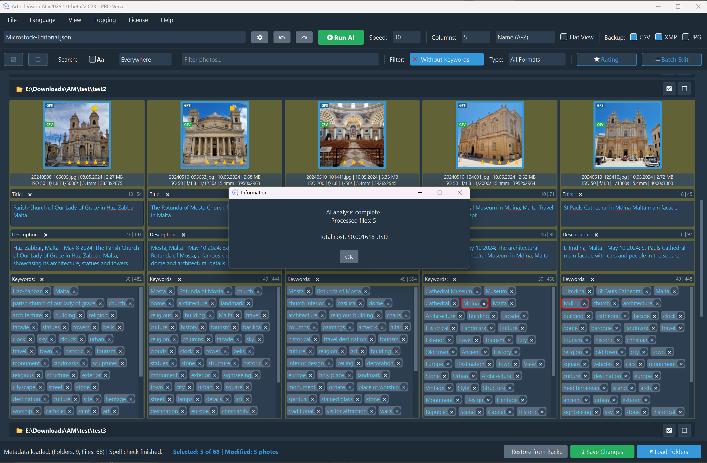

# ArtushVision AI
### The Ultimate AI-Powered Metadata & Keywording Tool for Photographers and Videographers

 

*“Intelligent metadata automation for your Travel, Home, and Stock photography workflow with state-of-the-art Vision AI.”*

**ArtushVision AI** is a professional desktop application designed to streamline the workflow of photographers, videographers, and archivists. It leverages state-of-the-art Computer Vision AI (via OpenRouter) to automatically generate keywords, titles, and descriptions for **JPG, RAW, and video** assets, while providing robust tools for manual metadata management. Your data is always safe with automated backups and flexible export options to CSV and XMP sidecars, ensuring you never lose your progress or original file integrity.

> **⚡ Exceptional Value:** Using our recommended model, **google/gemini-2.0-flash-001**, you can professionally describe approximately **100,000 to 150,000 photos for only $5** with perfect, high-quality results.
> 
> **📊 Full Cost Control:** Monitor your budget with built-in **spending statistics**. The app provides real-time feedback on the exact cost of every single query.

Beyond AI automation, it offers a complete organization toolkit, including **star ratings, pick/reject flags, and color-coded labels** to help you curate and filter your media with ease. Full compatibility with **Adobe Lightroom, Bridge, Zoner, DigiKam and others**. We use industry-standard IPTC/XMP metadata that works everywhere.

### 📖 Resources & Guides
* [ArtushVision AI - Overview](https://www.artushfoto.eu/Software/ArtushVisionAI)
* [ArtushVision AI - Basic workflow introduction video](https://www.artushfoto.eu/Software/ArtushVision-AI-basic-workflow)
* [ArtushVision AI - OpenRouter API Key Setup](https://www.artushfoto.eu/Software/OpenRouter-API-Key-Setup-Guide-for-Beginners)

---

### 💎 Get Lifetime License for $39.99
[**Purchase ArtushVision AI here**](https://www.artushfoto.eu/Software/Purchase-ArtushVision-AI) 
*(+ local VAT calculated at checkout)*

**One-time payment • No monthly fees** 
Pay once, use forever. Securely processed by Polar & Stripe.

[🔓 Already have a license? Manage or Deactivate your devices](https://www.artushfoto.eu/Software/Manage-ArtushVision-AI-License)

