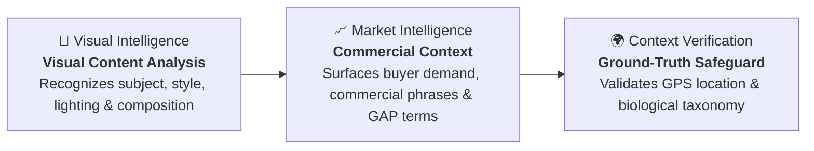
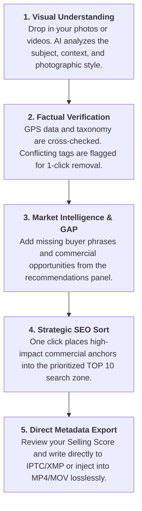

<div style="display: none;">
<style>
header, .page-header, .site-header, footer, .site-footer, .footer { display: none !important; }
h1 { text-align: center; }
/* Profesionální styl pro klikací screenshoty */
.screenshot-link {
  display: block;
  margin: 20px auto;
  max-width: 100%;
  text-decoration: none;
}
.screenshot-img {
  width: 100%;
  height: auto;
  display: block;
  border: 1px solid #333;
  border-radius: 6px;
  box-shadow: 0 4px 12px rgba(0,0,0,0.15);
  transition: opacity 0.2s;
}
.screenshot-img:hover {
  opacity: 0.95;
}
/* GitHub Téma vyhledávacího komponentu (Světlý i Tmavý režim) */
#flex-search-container {
  max-width: 500px;
  margin: 25px auto;
  position: relative;
  font-family: -apple-system, BlinkMacSystemFont, "Segoe UI", "Noto Sans", Helvetica, Arial, sans-serif;
}
#flex-search-input {
  width: 100%;
  padding: 12px 16px;
  font-size: 14px;
  line-height: 20px;
  border-radius: 6px;
  box-sizing: border-box;
  transition: border-color 0.2s, box-shadow 0.2s, background-color 0.2s, color 0.2s;
  border: 1px solid #d0d7de;
  background-color: #f6f8fa;
  color: #24292f;
}
#flex-search-input::placeholder {
  color: #57606a;
  opacity: 1;
}
#flex-search-input:focus {
  outline: none;
  background-color: #ffffff;
  border-color: #0969da;
  box-shadow: 0 0 0 3px rgba(9, 105, 218, 0.3);
}
#flex-results-container {
  position: absolute;
  top: 100%;
  left: 0;
  width: 100%;
  border-radius: 6px;
  list-style: none;
  padding: 0;
  margin: 8px 0 0 0;
  z-index: 100;
  max-height: 300px;
  overflow-y: auto;
  display: none;
  background-color: #ffffff;
  border: 1px solid #d0d7de;
  box-shadow: 0 8px 24px rgba(140, 149, 159, 0.2);
}
#flex-results-container li {
  border-bottom: 1px solid #d0d7de;
}
#flex-results-container li:last-child {
  border-bottom: none;
}
#flex-results-container li a {
  display: block;
  padding: 12px 16px;
  text-decoration: none;
  font-size: 14px;
  font-weight: 500;
  color: #24292f;
  transition: background-color 0.1s, color 0.1s;
}
#flex-results-container li a:hover {
  background-color: #0969da;
  color: #ffffff;
}
#flex-results-container .no-results-msg {
  padding: 12px 16px;
  color: #57606a;
  font-style: italic;
  font-size: 14px;
}
@media (prefers-color-scheme: dark) {
  #flex-search-input {
    border: 1px solid #30363d;
    background-color: #0d1117;
    color: #c9d1d9;
  }
  #flex-search-input::placeholder {
    color: #8b949e;
  }
  #flex-search-input:focus {
    border-color: #58a6ff;
    box-shadow: 0 0 0 3px rgba(88, 166, 255, 0.3);
  }
  #flex-results-container {
    background-color: #161b22;
    border: 1px solid #30363d;
    box-shadow: 0 8px 24px rgba(1, 4, 9, 0.8);
  }
  #flex-results-container li {
    border-bottom: 1px solid #21262d;
  }
  #flex-results-container li a {
    color: #c9d1d9;
  }
  #flex-results-container li a:hover {
    background-color: #1f6feb;
    color: #ffffff;
  }
  #flex-results-container .no-results-msg {
    color: #8b949e;
  }
}
</style>
</div>

# Turn Visual Content into Commercially Focused Stock Metadata

### Connect visual AI, marketplace search intelligence, and factual verification to discover in-demand keywords and position them where search algorithms look first.

Most keywording tools simply describe what appears in a photo. But in competitive microstock marketplaces, descriptive tags alone may not fully capture the commercial intent behind buyer searches. Stock platforms use factors such as relevance, keyword order, and search behavior when determining search visibility.

**ArtushVision AI** bridges the gap between what an image depicts and what commercial buyers are actually searching for.

[← Back to ArtushVision AI Home](https://vision.artushfoto.eu/)

---

## The Fundamental Shift in Stock Keywording

### From “What is visible in the photo” to “What buyers actually search for”

Traditional image recognition identifies physical objects. **Market Intelligence** translates those visual elements into the commercial search vocabulary used by designers, art directors, and media buyers.

| Basic Visual Tagging *(Descriptive Only)* | ArtushVision Market Intelligence *(Buyer-Oriented)* |
| :--- | :--- |
| `bird`, `branch`, `nature`, `wildlife`, `forest` | `endemic songbird`, `bird watching`, `natural habitat`, `avian wildlife`, `tropical rainforest` |
| `woman`, `laptop`, `desk`, `office` | `authentic remote worker`, `hybrid lifestyle`, `female entrepreneur`, `copy space for text` |
| `coffee`, `cup`, `table`, `drink` | `artisan flat white`, `specialty coffee shop`, `morning routine`, `isolated on white` |

---



---

1. **Visual Intelligence:** Accurately identifies primary subjects, secondary details, composition, and photographic mood.
2. **Market Intelligence:** Evaluates commercial demand, connecting your image to buyer search vocabulary, multi-word phrases, and seasonal opportunities.
3. **Context Verification:** Cross-checks camera GPS data and biological references to prevent geographic contradictions and species confusion before submission.

---

## 🔍 Bestseller GAP Analysis & Commercial Phrases

### Identify commercially relevant terms your metadata may be missing.

Bestseller GAP analysis compares your keyword set with commercial search patterns in your subject area, highlighting valuable metadata opportunities you may have overlooked.

<!-- SCREENSHOT HERO: BESTSELLER GAP INTERFACE -->
```
┌─────────────────────────────────────────────────────────────────────────────┐
│  Current Keywords:                                                          │
│  bird · branch · perch · nature · colorful                                  │
├─────────────────────────────────────────────────────────────────────────────┤
│  Bestseller GAP (Commercially Relevant Missing Opportunities):              │
│  [+ endemic species]  [+ wildlife photography]  [+ tropical rainforest]     │
│  [+ bird watching]    [+ avian wildlife]        [+ plumage in sunlight]     │
└─────────────────────────────────────────────────────────────────────────────┘
```

* **1-Click Phrase Insertion:** Click any recommended phrase bubble to immediately add it to your active keywords.
* **Suggestion Control:** Adjust the breadth of recommendations from close literal matches to broader conceptual opportunities.
* **Market Discovery:** Surface emerging search queries, modern terminology, and seasonal trends tailored specifically to your visual subject.

---

## 🎯 Commercial Selling Score & Quick Wins

### Real-time, data-driven feedback on your metadata's commercial readiness.

The **Selling Score (0–100%)** gives you an immediate benchmark of your metadata's commercial strength, keyword balance, and completeness.

<!-- SCREENSHOT: SELLING SCORE & QUICK WINS -->
```
┌─────────────────────────────────────────────────────────────────────────────┐
│  Selling Score: [████████████████░░░░] 82%                                  │
├─────────────────────────────────────────────────────────────────────────────┤
│  Quick Wins (Recommended Improvements)                                      │
│  ➕ Add: endemic songbird · natural habitat · avian wildlife                 │
│  ➖ Remove: background (redundant) · animalia (overly broad)                │
└─────────────────────────────────────────────────────────────────────────────┘
```

* **Live Dynamic Recalculation:** The score updates instantly as you add, remove, or reorder keywords.
* **Balanced Coverage Guidance:** Guides you toward optimal keyword depth, discouraging both under-tagging and metadata dilution.
* **1-Click Quick Wins:** The diagnostic panel separates recommendations into high-impact terms to **Add (+)** and weak or redundant terms to **Remove (−)** with a single click.

> [!NOTE]
> The Selling Score is a data-driven metadata analysis benchmark designed to help evaluate commercial readiness. It is not an algorithmic prediction or guarantee of future sales or search rankings.

---

## ⚡ Strategic SEO Sort & Visual Dividers

### Position high-impact keywords where stock search algorithms look first.

Stock platforms may place significant weight on keyword position, making the ordering of your most relevant terms an important part of metadata optimization. **Intelligent SEO Sort** reorganizes your entire keyword list in one click.

<!-- SCREENSHOT: KEYWORD BUBBLES WITH VISUAL DIVIDERS -->
```
TOP 10 PRIORITY ZONE (Primary Commercial Anchors)
[african elephant]  [safari wildlife]  [kenya savanna]  [endangered species]  [tusker]
─────────────────────────────────────────────────────────────────────────────
SECONDARY SEARCH TERMS (11–35 Contextual & Descriptive Metadata)
[natural habitat]  [game reserve]  [herbivore]  [wilderness]  [golden hour] ...
─────────────────────────────────────────────────────────────────────────────
BROAD DESCRIPTORS (36+ Supplementary Tags)
[dry season]  [mammal]  [horizontal]  [no people]  [outdoor]
```

* **1-Click Strategic Ordering (`Ctrl+Shift+S`):** Moves primary subject anchors and commercially relevant phrases to the front while shifting generic descriptors (*background, texture*) toward the end.
* **Visual Spacing Dividers:** Dedicated visual breaks after the **10th** and **35th** keywords make it easy to distinguish primary search terms from broader supporting metadata.
* **Complete Creative Control:** Drag and drop any keyword bubble manually whenever you want custom placement.

---

## 💡 Synonyms & Buyer-Intent Inspector

### Move beyond basic thesaurus lookups to real marketplace vocabulary.

Inspect any keyword to open the interactive **Synonyms & Tag Inspector**:

<!-- SCREENSHOT: SYNONYMS & BUYER-INTENT INSPECTOR -->
```
┌─────────────────────────────────────────────────────────────────────────────┐
│  Inspecting: "coffee"                                                       │
├─────────────────────────────────────────────────────────────────────────────┤
│  Smart Swap Suggestions:       [espresso]  [specialty coffee]  [cappuccino] │
│  Buyer-Intent Autocomplete:    [coffee with copy space] [coffee cup on desk]│
│  Bestseller Tag Insights:      [barista]  [morning routine]  [caffeine kick] │
│  Hover Translation & Lookup:   Instant native translation & definition      │
└─────────────────────────────────────────────────────────────────────────────┘
```

* **Smart Swap:** Replace generic or overused words with commercially relevant expressions in one click.
* **Buyer-Intent Autocomplete:** Explore multi-word phrases and common combinations buyers actually use when searching for that concept.
* **Bestseller Tag Insights:** Discover commercially relevant tags associated with successful stock imagery in that subject area.
* **Custom User Dictionary:** Save regional landmarks, unique local species, or personal trademarks so they are never flagged as unfamiliar words.

---

## 🛡️ Explainable Verdicts & 1-Click Clean-Up

### Clear, color-coded classifications replace black-box guesswork.

Every tag is evaluated with an intuitive verdict badge, giving you instant insight into its role:

<!-- SCREENSHOT: KEYWORD VERDICT BADGES -->
```
[ 🔥 MUST USE: songbird ]   [ ✅ RECOMMENDED: natural habitat ]   [ 🏷️ SUPPLEMENTARY: outdoor ]
[ ⚠️ WARNING: background ]  [ ❌ AVOID: amazon parrot ]
```

| Verdict Badge | Role & Recommendation |
| :--- | :--- |
| **🔥 MUST USE** | Core anchor term or commercially significant phrase. Priority for top positions. |
| **✅ RECOMMENDED** | Strong contextual tag with demonstrated commercial relevance. |
| **🏷️ SUPPLEMENTARY** | Accurate secondary descriptor providing broad thematic coverage. |
| **⚠️ WARNING** | Generic or ambiguous word that may dilute metadata impact. |
| **❌ AVOID** | Contradictory species, geographic mismatch, or invalid term. |

* **Interactive Filters:** Instantly filter your list by verdict to inspect only critical tags or potential issues.
* **1-Click Batch Clean-Up (`Remove ❌`):** Purge all contradictory, conflicting, or flagged tags across your entire file in a single click.

---

## 🌍 Ground-Truth Verification: Geo & Taxonomic Safeguards

### Automated factual protection against location errors and species confusion.

Inaccurate metadata can contribute to submission issues, relevance problems, or unwanted search results. ArtushVision AI includes built-in verification safeguards:

* **📍 Geographic GPS Verification:** Cross-checks camera GPS coordinates against geographic reference data to confirm countries, regions, and landmarks—helping prevent incorrect geographic associations and conflicting locations.
* **🧬 Taxonomic & Biological Safeguards:** Validates scientific Latin binomials and common names against biological taxonomy references, protecting against cross-species confusion and helping distinguish valid scientific names from misspelled or invalid terms.

---

## 🚀 The Complete Optimization Workflow



---

## What Market Intelligence Does — and Does Not Do

Market Intelligence is engineered to give stock contributors **data-driven commercial context, buyer search patterns, and metadata quality diagnostics**.

It does **not** guarantee:
* Specific sales volumes, guaranteed download counts, or revenue targets.
* Automatic first-page ranking across every individual stock agency search algorithm.
* Exemption from manual agency inspection standards or technical quality reviews.

Because marketplace demand and agency search algorithms evolve continuously, ArtushVision AI provides **actionable commercial insight, strategic keyword organization, and factual validation—while keeping you in complete creative control of your metadata.**

---

### Ready to elevate your microstock workflow?

[Explore Download & Licensing Options](https://vision.artushfoto.eu/docs/download-purchase.html) | [View Complete Documentation](https://vision.artushfoto.eu/index.html)
````

---

*ArtushVision AI — Precision, stability, and market intelligence for professional photography and video workflows.*


---

[← Back to ArtushVision AI Home](https://vision.artushfoto.eu)

[⭐ User Reviews & Testimonials](/docs/artushvision-reviews.html)

[❓ Frequently Asked Questions (FAQ)](/docs/faq.html)

[💬 Support, Bugs & Community Forum](https://github.com/Artushfoto/ArtushVision-AI/discussions)

[📷 Developer's Photography Portfolio: artushfoto.eu](https://artushfoto.eu)

---

*ArtushVision AI — intelligent metadata optimization for professional photography workflows.*

---

<!-- Odložené načtení Google Analytics pro maximální PageSpeed skóre -->
<script>
  document.addEventListener("DOMContentLoaded", function() {
    let analyticsLoaded = false;
    function loadAnalytics() {
      if (analyticsLoaded) return;
      analyticsLoaded = true;
      var gtagScript = document.createElement('script');
      gtagScript.async = true;
      gtagScript.src = 'https://www.googletagmanager.com/gtag/js?id=G-KCZWMGZFJ5';
      document.head.appendChild(gtagScript);
      window.dataLayer = window.dataLayer || [];
      window.gtag = function(){ dataLayer.push(arguments); }
      gtag('js', new Date());
      gtag('config', 'G-KCZWMGZFJ5');
      document.removeEventListener('scroll', loadAnalytics);
      document.removeEventListener('mousemove', loadAnalytics);
      document.removeEventListener('touchstart', loadAnalytics);
    }
    document.addEventListener('scroll', loadAnalytics, { passive: true });
    document.addEventListener('mousemove', loadAnalytics, { passive: true });
    document.addEventListener('touchstart', loadAnalytics, { passive: true });
    setTimeout(loadAnalytics, 5000);
  });
</script>
