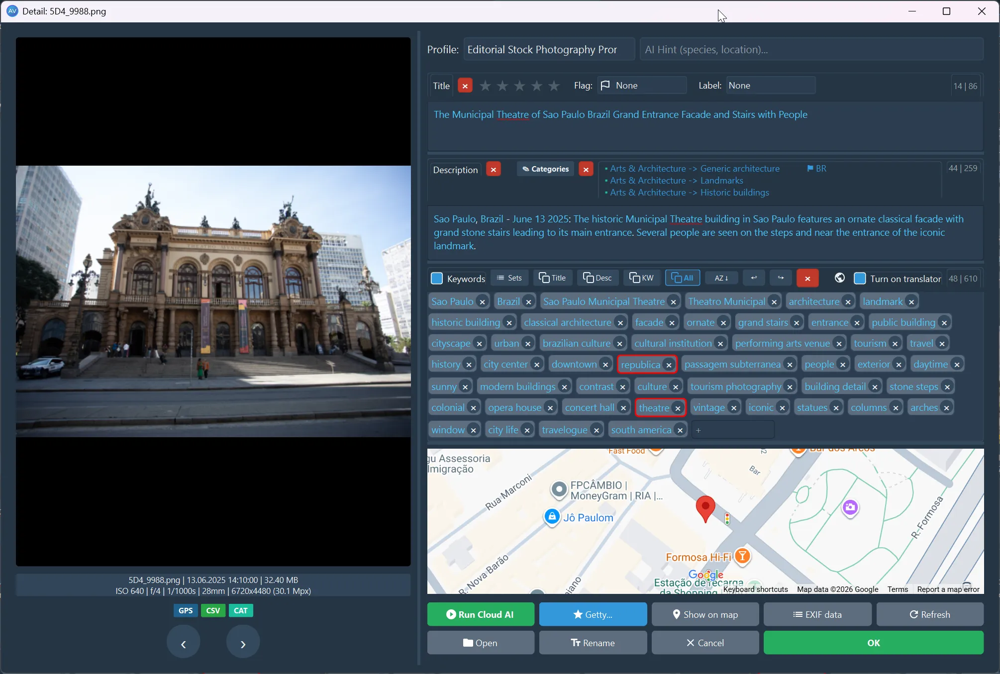
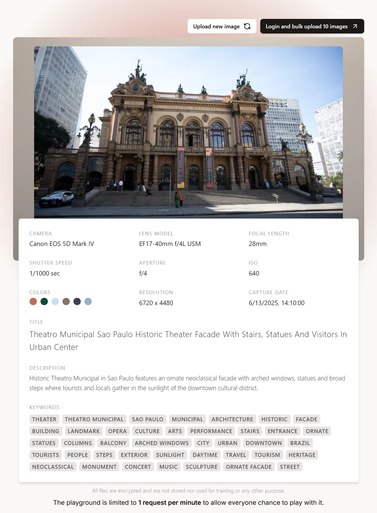

# ArtushVision AI vs. "Market Leaders": The Ultimate Microstock Keywording Tools & Private Archive Management Comparison (June 2026)

The modern microstock business demands extreme speed, metadata precision, and parallel distribution across multiple agencies (Adobe Stock, Shutterstock, Getty Images, Pond5, etc.). While the market has split into fast cloud-based web utilities and established desktop asset managers, a critical factor is often overlooked: Data Privacy, Security, and Specialized Platform Optimization.

---

## The Cloud Security Risk and The Privacy Dilemma

Most modern microstock tools function by forcing you to upload your high-resolution assets to their remote cloud servers for analysis. 

> ### Critical Security Warning
> To use cloud-based automated distribution features, you are required to save your FTP/SFTP usernames and passwords on their remote cloud servers. If these third-party platforms suffer a data breach, server exploit, or cloud database leak, your entire portfolio livelihood, financial stock accounts, and agency payout profiles can be exposed to malicious actors.

Furthermore, constantly uploading gigabytes of high-res files to the web is completely unviable for:
1. **Client Work Under NDA:** Commercial assignments, corporate portraits, and private events where non-disclosure agreements strictly forbid uploading proprietary files to unverified third-party cloud servers.
2. **Family and Personal Travel Archives:** Private photography assets that you do not want scraped, analyzed, or stored by corporate cloud entities.

## [The ArtushVision AI Ecosystem](https://vision.artushfoto.eu/)
Everything runs 100% locally on your machine. Your FTP credentials are **securely encrypted** and never leave your local drive, and thanks to an integrated local offline AI model manager, not a single pixel of your private, family, or client archives ever needs to touch the internet.

---

## [Integrated Getty & iStock Controlled Vocabulary Tool](getty-images-esp-metadata-optimizer.html)
Getty Images and iStock do not use standard open-ended text tags. They operate on a strict, controlled vocabulary to eliminate homonyms (e.g., separating the machine crane from the bird crane). If your keywords aren't mapped properly to their dictionary, your files require painful manual asset-by-asset disambiguation on their ESP platform or through tools like DeepMeta. Only a few tools provide optimization solutions for this specific bottleneck.

---

## Detailed Competitor Breakdown: Strengths vs. Weaknesses

### 1. Cloud-Based SaaS Utilities (Web Platforms)

#### Pixify Studio (pixify.io)
* **Pricing:** Ranges from $5/month (100 credits) to $59/month (3,000 credits), up to $115/month. Additional top-up credits cost $30 per 1,000.
* **Getty/iStock Optimization:** According to the website, the internal AI model is currently in development; costs 2 credits per generation.
* **EXIF & GPS Handling:** Completely ignores EXIF/GPS data during the AI keywording phase. The AI analyzes the image purely as a blind visual container, meaning location-specific context or technical camera data cannot be utilized to improve keyword precision.
* **Strengths:** Includes a decent Lightroom Classic plugin.
* **Weaknesses:** High credit anxiety. Heavy contributors face massive recurring costs. It lacks native local file management and an integrated FTP engine (users must manually download CSVs and upload via separate clients like FileZilla). Zero privacy.

<!-- Levý obrázek - ArtushVision AI -->
  

    
    

      <strong>ArtushVision AI (Editorial Profile)</strong> 
      Automatically assigns categories/countries and tailors descriptions to Shutterstock rules. Includes a <a href="global-stock-distribution-ftp.html" style="color: #0969da; text-decoration: none; font-weight: 600;">built-in FTP/FTPS client</a> to upload files directly from the app. For agencies like Shutterstock and Dreamstime, it <strong>automatically generates and submits the required CSV metadata files</strong> alongside your photos. Once uploaded, just log in and click submit. No extra setup needed! 
      Cost: $0.000662 USD per image
    

  

  <!-- Pravý obrázek - Pixify Studio -->
  

    
    

      <strong>Pixify Studio (Standard Output)</strong> 
      Generates generic titles, descriptions, and keywords. Completely rigid system with no options to customize prompts for specific market requirements. 
      Cost: Premium subscription required
    

  

---

### PhotoTag.ai (phototag.ai)
* **Pricing:** Monthly subscriptions or pay-as-you-go credit bundles (e.g., 10,000 Upload Credits / 1,000 file batch upload for €56).
* **Getty/iStock Optimization:** None. Generates generic keywords that do not map to the ESP controlled dictionary, offering no specialized support for Getty contributors.
* **EXIF & GPS Handling:** Zero ingestion of EXIF/GPS metadata. The cloud engine reads the uploaded files purely as raw pixels. If a photo features a specific monument or localized geographic event, the AI will describe it literally ("stone building, tower") instead of pulling the true historical or geographical name from geolocation metadata.
* **Strengths:** Clean web interface supporting photos, videos, and vectors. Lightroom Classic plug-in and API access available
* **Weaknesses:** Uses generic, rigid AI that describes scenes literally ("green pot, white background") rather than capturing commercial, high-ranking metadata concepts ("slow living, morning routine, authentic lifestyle"). Zero local file culling and no FTP modules.

---

### CyberStock (cyberstock.lol)
* **Pricing:** Annual plans start at $7/month (only 200 credits), Pro plan is $15/month (800 credits), and Unlimited costs $63/month ($756/year billed annually). Monthly pricing without a commitment spikes up to $159/month.
* **Getty/iStock Optimization:** CyberStock natively integrates with the Getty Images Controlled Vocabulary guidelines. 
* **EXIF & GPS Handling:** Metadata-blind AI processing. CyberStock focuses entirely on pipeline processing speed. The cloud-based AI bypasses any internal EXIF/GPS analysis, making it impossible to auto-inject geographical or hardware variables into the metadata generation process.
* **Strengths:** Very fast parallel cloud processing (~1.3s per asset), built-in marketing insights (SEMrush and Google Trends integration), and a Selling Score algorithm.
* **Weaknesses:** High security risk on the market. Demands that you store your raw stock agency passwords and FTP connections directly on their remote cloud infrastructure.

---

### PhotoKeyworder.ai (photokeyworder.ai)
* **Pricing:** Pay-as-you-go credit packs (20 free credits upon registration) or fixed tier at €8.99/month for 400 Images (or 133 Videos).
* **Getty/iStock Optimization:** Yes. Includes a specialized iStock/Getty Images optimization tool that outputs metadata tailored to their controlled vocabulary, generating DeepMeta and QHero-ready CSVs via cloud processing.
* **EXIF & GPS Handling:** Extracts geolocation data from EXIF to cross-reference location names on the cloud side. However, because it is a closed web browser interface, it cannot write this data back into the original local files natively—it only offers it as a downloadable CSV or sidecar text file.
* **Strengths:** Features a built-in AI image upscaler and extracts geolocation data from EXIF.
* **Weaknesses:** Trapped in a continuous web loop—manually dragging batches into a browser, configuring, and downloading ZIP/CSV files back to your drive. No native local workspace, zero asset organizational tools, and lacks an FTP module.

---

## 2. Traditional Desktop Powerhouses (Native Software)

### Xpiks Pro (xpiksapp.com)
* **Pricing:** Basic version is free. Pro License is a one-time €49 purchase. The advanced Pro+ tier costs €99/year (subscription) and is required to unlock AI keywording plugins (includes 4,000 credits/month).
* **Getty/iStock Optimization:** No native support. Lacks an integrated controlled vocabulary engine for Getty/iStock; users must map terms entirely manually or rely on basic external metadata structures.
* **EXIF & GPS Handling:** High-quality local EXIF reader and writer. It correctly displays GPS coordinates on a visual map within the desktop UI. However, a major disconnect exists: its AI keywording plugin operates externally via cloud downscaling and **completely ignores the GPS/EXIF data during AI generation**. The AI does not know where the photo was taken unless you manually type it into a text prompt beforehand.
* **Strengths:** Highly mature, lightning-fast native local file system navigator. Excellent background multi-threaded FTP uploads, automated vector ZIP creation, local search filtering, and color tag tagging.
* **Weaknesses:** AI keywording is treated as an external cloud add-on—Xpiks uploads a downscaled copy of your images to its remote servers to generate tags.

---

### ImStocker Studio (studio.imstocker.com)
* **Pricing:** Basic version is free. Pro License is $49.50/year or $250 for a lifetime license. Crucial Catch: AI keywording features (IMS Vision) are billed completely separately via recurring credit packs (approx. $42 to $170/year based on volume). 
* **Getty/iStock Optimization:** Yes. Interactive keyword refinement panel for manual Getty/iStock controlled vocabulary matching (though the cache is tied to the app database).
* **EXIF & GPS Handling:** Industrial-grade local EXIF/IPTC/XMP editor. It allows meticulous manual management of GPS coordinates, templates, and metadata schemas. But much like Xpiks, its native AI module (IMS Vision) is a visual-only cloud API. The AI engine itself does not automatically read or digest the file's GPS coordinates to contextualize its object recognition, forcing users to bridge the gap between AI visual tags and manual location tags themselves.
* **Strengths:** An absolute powerhouse for granular metadata micro-management. Supports different metadata sets for different agencies.
* **Weaknesses:** Overwhelming, highly complex interface with a steep learning curve. Its AI module is a closed cloud ecosystem (requires credits and remote data uploading). Getty and FTP tracking maps are tied strictly to the app database; if you move to a new PC, your metadata history and connection states are lost unless you manually migrate the database files.

---

## [The Core Advantages of ArtushVision AI](#key-features--functionality)

ArtushVision AI acts as a completely autonomous, private desktop bridge, combining advanced localized AI orchestration with absolute metadata control.

---

### [Built-In Offline Model Manager (Ollama)](ai-metadata-generation-cloud-local-ollama.html#5-local-ollama-model-setup--recommended-models)
ArtushVision AI features a clean graphical interface to manage local offline models via Ollama. For 100% free, private, and offline metadata generation, the application adapts perfectly to your hardware capabilities:

* **High-End Precision:** For users with powerful dedicated GPUs, advanced vision models from the Google Gemma family deliver flawless, highly accurate detail recognition and deep conceptual microstock storytelling. While processing takes slightly longer, the metadata precision is unmatched.
* **Lightweight & Fast:** For standard hardware setups, highly optimized community models (like *Llama-3.2-Vision* or *Moondream2*) provide lightning-fast processing speeds while staying safely within lower VRAM limits.

Need maximum commercial speed? Switch to the hybrid cloud mode using OpenRouter (Gemini Flash, GPT-4o), where you pay only raw API developer costs (approx. $6 per 10,000 images), bypassing steep SaaS markups.

### [Advanced AI Prompting Profiles & Dynamic Variables](advanced-ai-prompting-profiles-variables.html)
Unlike any competitor on the market that uses rigid, hardcoded, hidden system prompts, ArtushVision AI gives you total control through its revolutionary **[Dynamic Variable Prompt Engine](advanced-ai-prompting-profiles-variables.html#basic-and-contextual-variables)**. You can completely customize the underlying system instructions and map them to specialized profiles. 

By utilizing standardized formatting tokens and metadata placeholders, the app automatically extracts real-time information from the file and injects it straight into the AI’s prompt context. Available variables include:
* `{GPS}` / `{CITY}` / `{COUNTRY}` – Automatically feeds precise localized geographic data.
* `{CAMERA}` / `{LENS}` / `{ISO}` / `{FOCAL_LENGTH}` – Injects exact technical execution parameters.
* `{FILENAME}` / `{PARENT_FOLDER}` – Feeds organizational or contextual text clues directly to the model.

For example, a custom prompt template like:
`"Analyze this commercial stock image taken with {LENS}. The exact geographical location is {CITY}, {COUNTRY}. Generate 30 high-ranking SEO keywords tailored for Adobe Stock, prioritizing local terms."`
This allows the AI to cross-reference visual pixel arrays with exact technical and structural context, generating hyper-accurate, commercially relevant metadata completely customized by you.

### EXIF GPS Geolocation Integration
Visual recognition alone is often not enough for highly specific travel, architectural, or wildlife photography. ArtushVision AI automatically reads the GPS coordinates hidden in your files' EXIF data and injects this precise geographical context directly into the AI model using the variable pipeline. Instead of guessing a generic "tropical landscape," the AI knows exactly what region, city, or habitat it is analyzing. This generates highly accurate, localized keywords and precise species descriptions that drastically boost your SEO. Most desktop competitors completely ignore GPS data during AI keywording.

### [Local Getty Images / Batch iStock Optimization and Resolver](getty-images-esp-metadata-optimizer.html)
ArtushVision AI completely bypasses the frustration of iStock submissions. It includes a built-in offline Master Dictionary of over 9,800+ Getty-approved terms and an interactive Getty Resolver panel. AI-generated keywords are automatically parsed, resolved, and mapped to Getty's controlled vocabulary. If an exotic keyword isn't found, you can save it directly to a custom user dictionary or flag it under a "Candidates" field, ensuring your upload queues never freeze.

### [Customizable Profiles Presets](create-and-optimize-custom-ai-prompts.html)
Assign your variable-driven prompts to specific structural presets based on your active workflow:
* **Wildlife Profile:** Automatically instructs the AI to locate and append the exact scientific Latin names of fauna based on visual data and `{COUNTRY}`/`{GPS}` location tracking.
* **Studio Shots Profile:** Directs the model to analyze product placement, artificial lighting techniques, and studio aesthetics, auto-appending technical `{CAMERA}` settings if requested.
* **Editorial Profile:** Forces the AI to capture strict documentary reality based on `{FILENAME}` data while banning commercial buzzwords.

### [XMP-Centric Data Architecture (True Portability)](metadata-compatibility-and-file-handling.html)
While competitors lock your history into an isolated application database, ArtushVision AI writes its entire metadata ecosystem directly into the file's XMP metadata fields (or .xmp sidecars for RAWs). This includes your **FTP upload history**, your resolved **Getty controlled vocabulary mapping**, assigned **agency categories**, and the exact **customized order of your keywords**. Your files carry their own complete history. Move your archive folder to an external drive, open it on an entirely different computer, and ArtushVision instantly reads: which agencies the file has already been sent to, its exact structural categories, and the SEO-weighted sequence of its keywords. Everything stays perfectly intact.

### [Smart Category Management (AI and Manual)](category-matrix.html)
Stock agencies require sorting files into rigid structural categories (e.g., Nature, Technology, People). ArtushVision AI can automatically assign categories using AI visual analysis, or allow you to batch-apply predefined category sets manually across hundreds of selected files simultaneously. (And as mentioned above, this category data moves securely with the file via XMP).

### [Professional Culling and Batch Operations](batch-operations-metadata-library-management.html)
ArtushVision AI functions as a high-speed culling workspace for massive local catalogs (including native RAW and video formats):
* **Culling Suite:** Full support for Star Ratings (1–5), Color Labels, and Status Flags (Pick/Reject) compatible with Lightroom and other software.
* **Massive Batch Tools:** Select 500 files at once to apply ratings, perform advanced token-based file renaming with counters, or append/remove specific tags without destroying the unique keywords generated by the AI on individual files.
* **The Lightroom Alphabetical Sort Fix:** Lightroom automatically alphabetizes keywords upon export. This destroys stock SEO because Adobe Stock weights the first 10 keywords heaviest. ArtushVision AI features a one-click algorithm that restores keyword priority and order, paired with intuitive drag-and-drop sorting.

---

## Comprehensive Functional Matrix

| Feature / Parameter | ArtushVision AI | ImStocker Studio | Xpiks Pro | CyberStock | Pixify Studio | PhotoTag.ai | PhotoKeyworder.ai |
| :--- | :--- | :--- | :--- | :--- | :--- | :--- | :--- |
| **Application Type** | **Native Desktop Bridge** | Native Desktop | Native Desktop | Cloud Web App | Cloud Web App | Cloud Web App | Cloud Web App |
| **Pricing Model** | **One-time $39.99** (Lifetime) | $49.50/yr or $250 lifetime + extra AI costs | €49 one-time or €99/yr for AI tier | Subscription $14 to $159/mo | Subscription $5 to $115/mo | 1,000 file batch for €56 | €8.99/mo (400 images) or Pay-as-you-go |
| **100% Privacy / Offline Mode** | **Yes** (Native Ollama Integration) | Limited | No (AI uploads to cloud) | No (Entirely cloud-hosted) | No (Entirely cloud-hosted) | No (Entirely cloud-hosted) | No (Entirely cloud-hosted) |
| **Security Profile (FTP Credentials)** | **Zero Risk** (Stored strictly locally) | Zero Risk (Stored strictly locally) | Zero Risk (Stored locally) | **High Risk** (Saved on remote cloud servers) | N/A (No FTP module) | N/A (No FTP module) | N/A (No FTP module) |
| **EXIF GPS AI Keywording Integration**| **Yes** (Context directly feeds AI) | No (Map tagging only, AI ignores it) | No (AI ignores GPS data entirely) | No | No | No (AI ignores GPS) | **Yes** (Extracts EXIF geolocation) |
| **Dynamic Prompting Variables** | **Yes** (Tokens: `{GPS}`, `{LENS}`, etc.) | No (Static UI/closed system) | No (Hardcoded prompts) | No | No | No | No |
| **Getty / iStock Optimization** | **Yes** (Interactive Local Resolver) | **Yes** (Selection Panel + App DB Cache) | No (Manual entry/plugins only) | Yes (Controlled Vocabulary Guidelines) | No (Standard flat text tags only) | No (Standard flat text tags only) | **Yes** (Cloud-generated ESP CSV) |
| **Upload Status Tracking** | **Directly inside XMP metadata** | Inside local app database | Inside local app database | Inside cloud database | N/A (No FTP module) | N/A (No FTP module) | N/A (No FTP module) |
| **Data Portability (Categories & Tags)** | **Directly inside XMP metadata** | Inside local app database | Inside local app database | Inside cloud database | N/A | N/A | N/A |
| **Recommended Local Models** | **Yes** (Gemma family and others, local manager) | No | No | No | No | No | No |
| **Custom System Prompt Editing** | **Yes** (Fully customizable profiles) | Limited | No | No | No | No | No |
| **Category Management** | **Yes** (AI Auto + Manual Sets via XMP) | Yes (Manual Only via App DB) | Yes (Manual Only via App DB) | Partial (AI Only) | No | No | No |
| **Culling Suite (Stars, Colors, Flags)** | **Yes** (Complete sorting toolkit) | Yes | Partial (Color tags only) | No | No | No | No |
| **Lightroom Alphabetical Sort Fix** | **Yes** (Critical for Adobe Stock SEO) | No | No | No | No | No | No |
| **Metadata Batch Operations** | **Yes** (Advanced) | Yes | Yes | Limited (Browser latencies) | No | No | No |
| **Getty/iStock Vocabulary Cache** | **Yes** (Stored permanently in XMP field) | Yes (Tied to app database) | No | No | No | No | No (Temporary cloud session) |

---

### [Get Started Now]
* [Download Free Lite Version](/docs/download-purchase.html)
* [Purchase Lifetime License - $39.99](/docs/download-purchase.html#buy-lifetime-license)

---

## Need Help?

Search the documentation pages directly or jump back to the main [Complete Documentation Index](/index.html#complete-documentation-index).

---

[← Back to ArtushVision AI Home](https://vision.artushfoto.eu)

[⭐ User Reviews & Testimonials](/docs/artushvision-reviews.html)

[❓ Frequently Asked Questions (FAQ)](/docs/faq.html)

[💬 Support, Bugs & Community Forum](https://github.com/Artushfoto/ArtushVision-AI/discussions)

---

*ArtushVision AI - Stability and precision for professional photography workflows.*

