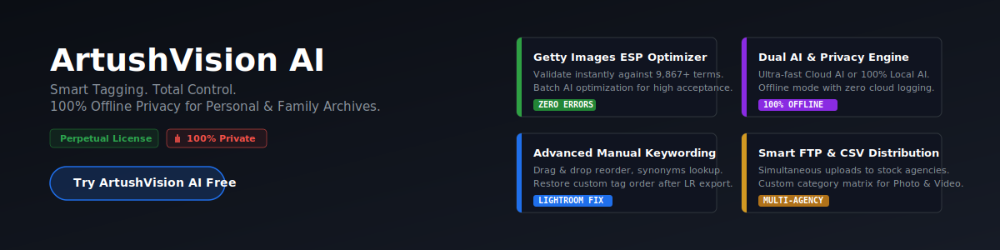
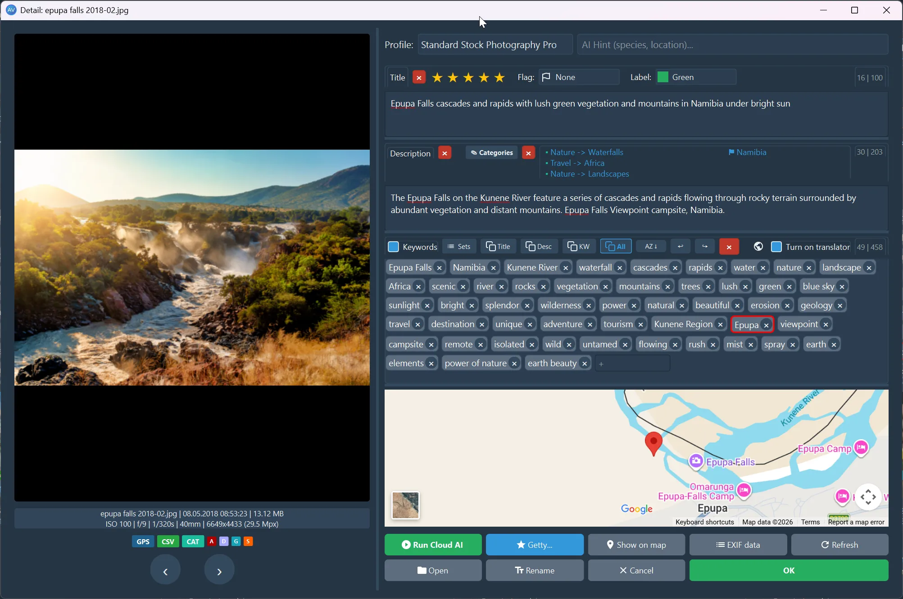

<main>

<h1 style="text-align: left; margin-top: 0; padding-top: 0; font-size: 2.2em;">ArtushVision AI | Professional Metadata Automation</h1>

  <object type="image/svg+xml" data="artushvision.svg" style="width: 100%; height: auto; aspect-ratio: 841.89 / 210.47; display: block; pointer-events: auto !important; outline: none; border: none; margin: 0; padding: 0;">
    
  </object>

  

    
<strong>The Ultimate AI-Powered Workstation for Metadata, Asset Management, and Global &amp; FTP Distribution.</strong>

    
    <blockquote style="margin: 20px 0 20px 0; font-size: 0.95em; color: #57606a; padding-left: 15px; border-left: 4px solid #0969da; font-style: italic;">
      "ArtushVision AI has rapidly evolved into the <strong>Swiss Army Knife of metadata management</strong>... From handling keywording of raw files, resolving the annoying Lightroom habit of sorting keywords alphabetically, to providing a smooth solution for the Getty/iStock controlled vocabulary... <strong>this is very hard to beat.</strong>"
       
      
        &mdash; Steven Heap, BackyardSilver (<a href="/docs/artushvision-reviews.html" title="Read full user reviews">Read Full Review &rarr;</a>)
      
    </blockquote>
    
    

      <a href="/docs/download-purchase.html" class="btn btn-primary">Download Free Trial</a>
      <a href="/docs/download-purchase.html#buy-lifetime-license" class="btn btn-success">Buy License - $39.99</a>
    

  

  
  

    
  

  <h2>🔒 100% Offline Privacy for Travel, Home &amp; Personal Archives</h2>
  

    Protect your family memories, private travel logs, and sensitive client shoots. By running advanced Vision models entirely <strong>locally on your own hardware</strong>, your images are analyzed right on your graphics card. <strong>No photos ever leave your computer</strong>, zero data is uploaded to corporate clouds, and absolute data logging privacy is fully guaranteed.
  

<strong>STOP paying rent</strong> for your software or credits. For just $39.99, the price of a <strong>casual dinner for two</strong>, you get a powerful tool that is yours forever. <strong>No expensive monthly subscriptions</strong>, no strings attached. Run it <strong>completely offline for maximum privacy</strong>, or connect to <strong>cloud AI</strong> whenever you need it with <strong>total control</strong> over your usage and costs. <strong>It’s a one-time investment that pays for itself in just two hours of saved work.</strong>

<h2>The 3-Step Production Workflow</h2>

ArtushVision AI eliminates the friction between editing software, AI tagging, and final asset organization:

<ol>
  <li><strong>Load &amp; Cull:</strong> Open thousands of RAW or JPG files across multiple subfolders instantly using the <strong>Flat View</strong>, filter out the noise, and organize your batch using native Lightroom-compatible star ratings and color labels.</li>
  <li><strong>Generate &amp; Resolve:</strong> Trigger the <strong>Cloud or 100% Private Local AI</strong> to build high-converting titles and tags. Run the <strong>built-in AI/Offline Getty Resolver</strong> to automatically match official commercial taxonomies and clear homonym ambiguities in seconds.</li>
  <li><strong>Automated FTP Upload:</strong> Select your pre-saved Agency Profile and hit Upload. The software manages multi-threaded transfers, dynamically generates agency-specific CSV files on-the-fly, and automatically stamps your grid with visual success badges.</li>
</ol>

<h2>Why ArtushVision AI?</h2>

<ul>
  <li><strong><a href="/docs/ai-metadata-generation-cloud-local-ollama.html">Versatile AI Engine</a>:</strong> Choose between ultra-fast and accurate Cloud AI via OpenRouter or <strong>100% Private Local AI</strong> running fully offline. Keep personal archives, home family photos, travel journals, or sensitive unreleased commercial shoots completely safe on your local drive with zero cloud logging and zero API costs.</li>
  <li><strong><a href="/docs/smart-manual-keywording-batch-editing.html">Advanced Manual Keywording</a>:</strong> Take total control. Manually add, drag-and-drop reorder, or delete keyword bubbles, and easily assign relevant categories. Features real-time word counters, synonyms lookup, and multilingual spellcheck suggestions.</li>
  <li><strong><a href="/docs/category-matrix.html">Smart Category Mapping</a>:</strong> A customizable translation matrix that maps your internal metadata categories directly into agency-specific requirements (Adobe Stock, Dreamstime, etc.) with separate internal logic for Photo vs. Video assets.</li>
  <li><strong><a href="/docs/getty-images-esp-metadata-optimizer.html">Getty Images Keyword Optimizer &amp; Resolver</a>:</strong> Validate keywords instantly against a built-in Master Dictionary of <strong>9,867+</strong> controlled Getty commercial terms. Choose between <strong>fast and intuitive manual validation</strong> or <strong>AI-powered optimization</strong> - available both for individual items and in <strong>batches</strong> - to ensure consistent, near-perfect acceptance rates.</li>
  <li><strong><a href="/docs/global-stock-distribution-ftp.html">Smart FTP Distribution</a>:</strong> Simultaneously upload files to multiple stock agencies with automated, agency-specific CSV metadata generation on-the-fly.</li>
  <li><strong><a href="/docs/metadata-compatibility-and-file-handling.html">Universal Compatibility</a>:</strong> Background integration using industry-standard formats compatible with Adobe Lightroom, Bridge, Zoner Photo Studio, and digiKam. ArtushVision AI lets you easily restore your original <strong>custom keyword order</strong> after Lightroom reshuffles it during export, safely appending any newly added tags to the end of the list.</li>
</ul>

<h2 align="center">💡 ZERO-RISK WORKFLOW: TRY BEFORE YOU BUY!</h2>

<table style="width: 100%; display: table; border-collapse: collapse;">
  <tr>
    <th style="width: 50%; text-align: center; padding: 12px;">
      <a href="/docs/download-purchase.html" class="btn btn-primary" style="margin: 0 auto;">Download Free Lite Version</a>
    </th>
    <th style="width: 50%; text-align: center; padding: 12px;">
      <a href="/docs/download-purchase.html#buy-lifetime-license" class="btn btn-success" style="margin: 0 auto;">Get Lifetime License</a>
    </th>
  </tr>
  <tr>
    <td style="text-align: center; padding: 10px;"><b>Fully Functional Version</b></td>
    <td style="text-align: center; padding: 10px;"><b>Only $39.99</b> (+ local VAT)</td>
  </tr>
  <tr>
    <td style="text-align: center; padding: 8px;">No time limits for testing</td>
    <td style="text-align: center; padding: 8px;">One-time payment &bull; No monthly fees</td>
  </tr>
</table>

 

  <strong>Securely processed by Polar &amp; Stripe.</strong> <a href="/docs/manage-licence.html">Manage your licensed devices</a>

<strong>ArtushVision AI Main Grid Workspace</strong>

<h2>Cost Comparison: Own Your Tools</h2>

<table style="width: 100%; border-collapse: collapse; margin: 15px 0;">
  <thead>
    <tr>
      <th style="border: 1px solid #d0d7de; padding: 8px; text-align: left;">Feature</th>
      <th style="border: 1px solid #d0d7de; padding: 8px; text-align: left;">Typical Online AI Tools</th>
      <th style="border: 1px solid #d0d7de; padding: 8px; text-align: left;">ArtushVision AI (Desktop App)</th>
    </tr>
  </thead>
  <tbody>
    <tr>
      <td style="border: 1px solid #d0d7de; padding: 8px;"><b>Media Privacy</b></td>
      <td style="border: 1px solid #d0d7de; padding: 8px;">Mandatory Cloud Upload</td>
      <td style="border: 1px solid #d0d7de; padding: 8px;">🔒 <b>100% Private (Local AI via Ollama)</b> or Thumbnail-only modes</td>
    </tr>
    <tr>
      <td style="border: 1px solid #d0d7de; padding: 8px;"><b>Format Support</b></td>
      <td style="border: 1px solid #d0d7de; padding: 8px;">JPG Only</td>
      <td style="border: 1px solid #d0d7de; padding: 8px;"><b>JPG, RAW, Video, TIFF, webp, HEIC</b></td>
    </tr>
    <tr>
      <td style="border: 1px solid #d0d7de; padding: 8px;"><b>Pricing Model</b></td>
      <td style="border: 1px solid #d0d7de; padding: 8px;">Recurring Subscriptions / Credits</td>
      <td style="border: 1px solid #d0d7de; padding: 8px;"><b>Perpetual License ($39.99)</b></td>
    </tr>
    <tr>
      <td style="border: 1px solid #d0d7de; padding: 8px;"><b>Cost (10,000 Photos)</b></td>
      <td style="border: 1px solid #d0d7de; padding: 8px;">High-tier monthly plans</td>
      <td style="border: 1px solid #d0d7de; padding: 8px;"><b>~$6</b> using Gemini Flash or <b>Free</b> utilizing Local AI</td>
    </tr>
  </tbody>
</table>

<blockquote style="margin: 20px 0; padding-left: 15px; border-left: 4px solid #d0d7de; color: #57606a;">
  
<strong>Exceptional Value:</strong> Describe up to <strong>10,000 photos for only $6</strong> with perfect, high-quality results. 
  <strong>Full Cost Control:</strong> Monitor your budget with built-in <strong>spending statistics</strong> (6-decimal precision).

</blockquote>

<h2>Complete Documentation Index</h2>

  <input type="text" id="flex-search-input" placeholder="Search documentation..." />
  <ul id="flex-results-container"></ul>

<h3>1. Getting Started</h3>
<ul>
  <li><a href="/docs/installation.html">System Requirements &amp; Installation</a></li>
  <li><a href="/docs/download-purchase.html">First Launch &amp; Activation</a></li>
  <li><a href="/docs/interface-overview.html">Interface Overview</a></li>
  <li><a href="/docs/detail-window-interface-overview.html">Detail Window Overview</a></li>
  <li><a href="/docs/cloud-ai-openrouter-api-setup.html">Cloud AI &amp; OpenRouter API Setup</a></li>
  <li><a href="/docs/local-ai-model-manager-ollama.html">Local AI Setup &amp; Integrated Model Manager</a></li>
</ul>

<h3>2. Core Workflows</h3>
<ul>
  <li><a href="/docs/ai-metadata-generation-cloud-local-ollama.html">Understanding AI Processing Modes (Cloud, Local, Hybrid)</a></li>
  <li><a href="/docs/how-to-download-local-ai-models-via-ollama.html">How to Download Local AI Models via Ollama</a></li>
  <li><a href="/docs/local-ai-model-manager-ollama.html">Local AI Model Manager: Complete Offline Control</a></li>
  <li><a href="/docs/advanced-ai-prompting-profiles-variables.html">Advanced AI Prompting, Profiles &amp; Variables</a></li>
  <li><a href="/docs/create-and-optimize-custom-ai-prompts.html">Create and Optimize Custom AI Prompts</a></li>
  <li><a href="/docs/smart-manual-keywording-batch-editing.html">Manual Editing, Multi-language Spellcheck &amp; Interactive Map</a></li>
  <li><a href="/docs/batch-operations-metadata-library-management.html">Batch Metadata Actions, Search &amp; Replace</a></li>
  <li><a href="/docs/category-matrix.html">Microstock Category Mapping Matrix</a></li>
  <li><a href="/docs/smart-grid-filters-search-metadata-management.html">Smart Grid Filters and Search</a></li>
</ul>

<h3>3. Professional Asset Distribution</h3>
<ul>
  <li><a href="/docs/getty-images-esp-metadata-optimizer.html">Getty Images ESP Metadata Optimizer &amp; Resolver</a></li>
  <li><a href="/docs/global-stock-distribution-ftp.html">Global Stock Distribution &amp; Multi-threaded FTP Suite</a></li>
  <li><a href="/docs/settings-configuration-customization.html#advanced-csv-template-editor">Dynamic CSV Template Mapping</a></li>
</ul>

<h3>4. Advanced Management</h3>
<ul>
  <li><a href="/docs/settings-configuration-customization.html">Workspace Theming, VRAM context tuning &amp; Data Safety</a></li>
</ul>

<h3>Get Started Now</h3>
<ul>
  <li><a href="/docs/download-purchase.html">Download Free Lite Version</a></li>
  <li><a href="/docs/download-purchase.html#buy-lifetime-license">Purchase Lifetime License - $39.99</a></li>
</ul>

  <a href="https://vision.artushfoto.eu">← Back to ArtushVision AI Home</a>  
  <a href="/docs/faq.html">❓ Frequently Asked Questions (FAQ)</a>  
  <a href="/docs/artushvision-reviews.html">⭐ User Reviews &amp; Testimonials</a>  
  <a href="https://github.com/Artushfoto/ArtushVision-AI/discussions">💬 Support, Bugs &amp; Community Forum</a>

<i>ArtushVision AI - Stability and precision for professional photography workflows.</i>

</main>

